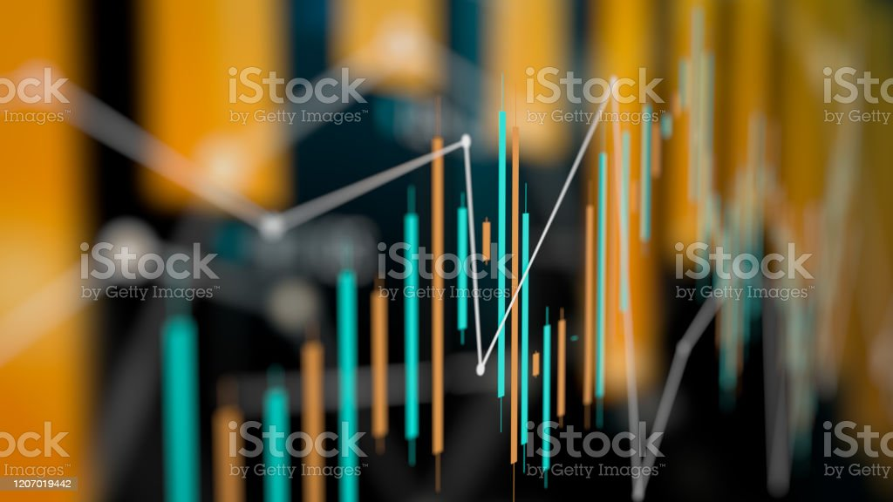

## Project-3 - The Analysis of World Events and Stock Prices

### Project Description:

  - Our Group is working on the analysing the financial conditions of different sectors by reviewing the stock statistics of the all the different  companies in each sectors. Over past 6 months there are some significant changes happening in the ecomony, All the prices of good are going up, gasoline prices are on another level and Inflation rate is much higher, So we decided to take a look on stocks for some companies and there as follows by their own sector as follows: 
  
| Sector  | Company Name | 
| ------------- | ------------- | 
| Basic Material | <ul><li> The Sherwin Williams Company </li></ul>  |
| Communication  | <ul><li> Netflix </li></ul>|
| Consumaer Cyclical   | <ul><li> Amazon </li></ul> |
| Consumaer Defensive  | <ul><li> CostCo </li></ul>  |
| Oil & Gas  | <ul><li> MArathon Oil Corp </li></ul>|
| Finanacial Services  | <ul><li> The Bank of America </li></ul> |
| HealthCare  | <ul><li> United Healthcare Group </li></ul>  |
| Industrials  | <ul><li> FedEx </li></ul>|
| Real Estate   | <ul><li> American Tower Corp </li></ul> |
| Technology | <ul><li> Apple </li></ul>  |
| Utilities  | <ul><li> DTE Energy Co. </li></ul>|

### Tools and Resources used:

 - Python APIs
    - Javascript
    - Plot.ly 
    - SQLite
    - PostgreSQL 
    - HTML | CSS
    - Bootstrap
    - Pandas
    - Source to dataset: https://www.kaggle.com/datasets/andrewmvd/sp-500-stocks
    
    
    
    
